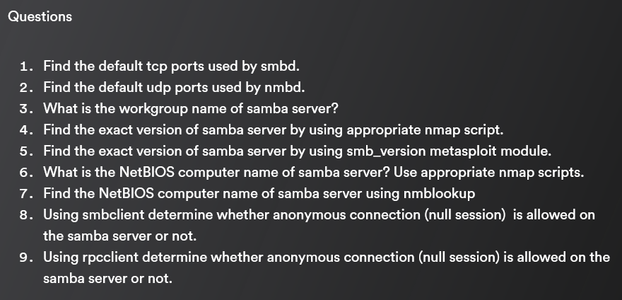

# SMB Lesson

## SMB: Windows Discover & Mount

SMB (Server Message Block) is a windows implementation of a file share

CIFS (Common Internet File System)

1. **Server Message Block (SMB):** SMB is a network file sharing protocol that allows applications and users on a network to read, write, and request services from server systems over a network. Originally developed by IBM, it has been significantly advanced and popularized by Microsoft. SMB enables computers to communicate with each other and share files and printers across a network. It is heavily used in Windows environments but is also compatible with other operating systems.
2. **Common Internet File System (CIFS):** CIFS is a version of the SMB protocol. It was introduced by Microsoft in the 1990s as an enhancement of the original SMB protocol. CIFS runs over TCP/IP and is used to allow file sharing and printing across a network. It's considered a dialect of SMB and is often referred to interchangeably with SMB, especially in the context of Windows networks.

In essence, CIFS is a specific implementation of SMB. Over time, the SMB protocol has evolved, leading to different versions like SMB1, SMB2, and SMB3. Each of these versions brought improvements and changes in aspects such as performance, security, and features.

<figure><figcaption></figcaption></figure>

Port 445 : SMB or CIFS

Port 139/tcp netbios-ssn : usually set up Sessions for SMB


Run a service enumeration and operation system scan:

```bash
nmap 10.4.17.133 -sV -O
```

<figure><figcaption></figcaption></figure>

Run a service and default script scan:

```bash
nmap 10.4.17.133 -sV -sC
```

<figure><figcaption></figcaption></figure>

<figure><figcaption></figcaption></figure>

<figure><figcaption></figcaption></figure>

<figure><figcaption></figcaption></figure>

### Lab: **Windows Recon: SMB Discover and Mount**

<figure><figcaption></figcaption></figure>

<figure><figcaption></figcaption></figure>

<figure><figcaption></figcaption></figure>

<figure><figcaption></figcaption></figure>

<figure><figcaption></figcaption></figure>

<figure><figcaption></figcaption></figure>

<figure><figcaption></figcaption></figure>

<figure><figcaption></figcaption></figure>

<figure><figcaption></figcaption></figure>

<figure><figcaption></figcaption></figure>

<figure><figcaption></figcaption></figure>

<figure><figcaption></figcaption></figure>

We have successfully discovered a target host machine and mounted their network shared folder to the attacker machine i.e local machine.

## SMB: Nmap Scripts

### Lab: Windows Recon: SMB Nmap Scripts

<figure><figcaption></figcaption></figure>

<figure><figcaption></figcaption></figure>

<figure><figcaption></figcaption></figure>

<figure><figcaption></figcaption></figure>

<figure><figcaption></figcaption></figure>

<figure><figcaption></figcaption></figure>

<figure><figcaption></figcaption></figure>

<figure><figcaption></figcaption></figure>

<figure><figcaption></figcaption></figure>

<figure><figcaption></figcaption></figure>

<figure><figcaption></figcaption></figure>

<figure><figcaption></figcaption></figure>

<figure><figcaption></figcaption></figure>

## SMB: SMBMap

```bash
smbmap -u guest -p "" -d . -H 10.0.28.123
```

\-u means user

\-p means password

\-d means directory

\-H means host

### Lab: Windows Recon: SMBMap

<figure><figcaption></figcaption></figure>

<figure><figcaption></figcaption></figure>

<figure><figcaption></figcaption></figure>

<figure><figcaption></figcaption></figure>

<figure><figcaption></figcaption></figure>

<figure><figcaption></figcaption></figure>

## SMB: Samba 1

### Lab: Samba Recon: Basics

<figure><figcaption></figcaption></figure>

<figure><figcaption></figcaption></figure>

<figure><figcaption></figcaption></figure>

<figure><figcaption></figcaption></figure>

<figure><figcaption></figcaption></figure>

<figure><figcaption></figcaption></figure>

<figure><figcaption></figcaption></figure>

<figure><figcaption></figcaption></figure>

<figure><figcaption></figcaption></figure>

## SMB: Samba 2

### Lab: Samba Recon: Basics II

<figure><figcaption></figcaption></figure>

<figure><figcaption></figcaption></figure>

<figure><figcaption></figcaption></figure>

<figure><figcaption></figcaption></figure>

<figure><figcaption></figcaption></figure>

<figure><figcaption></figcaption></figure>

<figure><figcaption></figcaption></figure>

<figure><figcaption></figcaption></figure>

<figure><figcaption></figcaption></figure>

## SMB: Samba 3

### Lab: Samba Recon: Basics III

