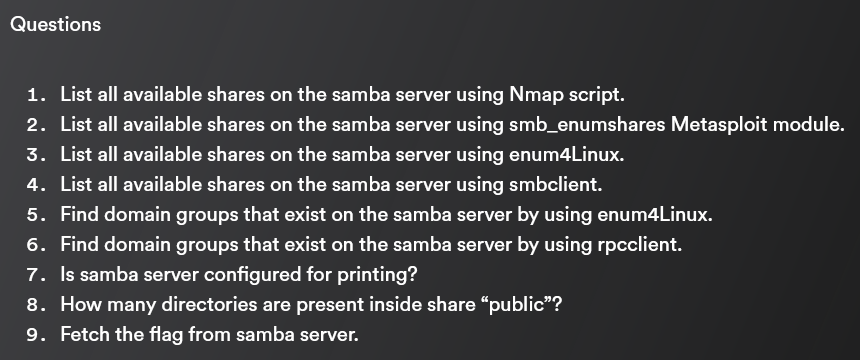

# Passive Information Gathering

## **Website Recon and foot printing**

```bash
whatis host
```

show the command do


Host command is for DNS lookup — means resolve DNS to IP address


If you saw two IPv4, maybe is dealing with some kind of proxy.

```bash
host hackerspolit.org
```

this command will show IPv4, IPv6 and the mail server.

\


When you looking for information on a website, the best way to start is /robots.txt file. Almost every website has it.

\


Disallow — means the website tells google/bing search engine to disregard which file when curl the website

Wp-content — shows this website running wordpress

\


sitemap.xml / sitemaps.xml file —&#x20;

\


Try Mozilla add-ons and install buildwith / wappalyzer / whatweb (kali building) / httrack

&#x20;

\


```bash
whatweb hackerspolit.org
```

\


## **Whois Enumeration**

```
whois hackersploit.org
```


```
whois 108.162.192.93
```


## **DNS Recon**

```bash
dnsrecon -d hackersploit.org
```


[https://dnsdumpster.com/](https://dnsdumpster.com/)


## **Netcraft website footprinting**

.png>)


## WAF with WAFW00F

Used to check a web application firewall

```bash
wafw00f -l
```

```bash
wafw00f hackersploit.org
```


